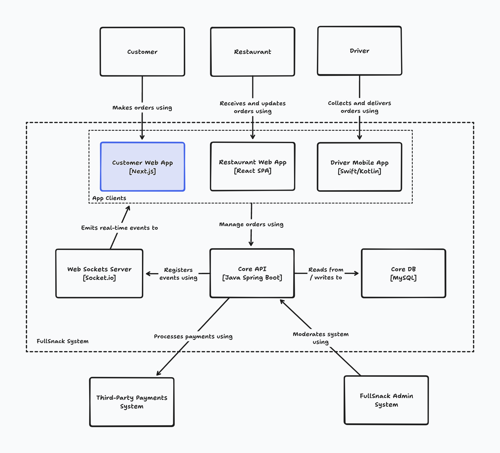

# Container Diagram

## C4 modules

Explanation pdf: https://github.com/Charca/frontend-architecture-workshop/blob/main/slides/2.3%20The%20C4%20Model.pdf

- Level 1: A System **Context diagram** provides a starting point, showing how the software system in scope fits into the world around it.

- Level 2: A **Container diagram** zooms into the software system in scope, showing the high-level technical building blocks.

- Level 3: A **Component diagram** zooms into an individual container, showing the components inside it.

- Level 4: A **code (e.g. UML class) diagram** can be used to zoom into an individual component, showing how that component is implemented.

## Container Diagram Example (for our project example)

### Source: https://github.com/Charca/frontend-architecture-workshop/blob/main/exercise-solutions/container-diagram-draft.png

---

